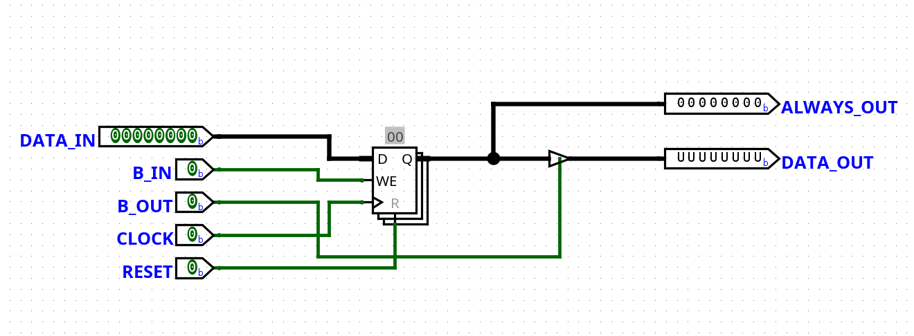

# P8: 8-bit CPU (Logisim Evolution)

This project is an **8-bit CPU built from scratch in Logisim Evolution**, inspired by the [Ben Eater](https://eater.net/8bit) design.

The CPU can fetch, decode, and execute instructions from memory.
In the demo program, it calculates the **Fibonacci sequence up to 255**.

---

## Features

* 8-bit data bus
* 16-bit instruction set (4-bit opcode + 4-bit operand)
* Registers: A (accumulator), Out, Program Counter, Instruction Register, Memory Address Register
* Flags: Zero, Carry
* Components: ALU, Control Unit, RAM, Clock

---

## Instruction Set

| Opcode | Mnemonic | Description                                   |
| ------ | -------- | --------------------------------------------- |
| 0000   | NOP      | No operation                                  |
| 0001   | LDA      | Load A reg with contents of given address     |
| 0010   | ADD      | Add contents of given address to A reg        |
| 0011   | SUB      | Subtract contents of given address from A reg |
| 0100   | STA      | Store contents of A reg at given address      |
| 0101   | LDI      | Load A reg with given value                   |
| 0110   | JMP      | Jump to given address                         |
| 0111   | JC       | Jump to given address if Carry Flag is set    |
| 1000   | JZ       | Jump to given address if Zero Flag is set     |
| 1001   | —        | N/A                                           |
| 1010   | —        | N/A                                           |
| 1011   | —        | N/A                                           |
| 1100   | —        | N/A                                           |
| 1101   | —        | N/A                                           |
| 1110   | OUT      | Load Out reg with contents of A reg           |
| 1111   | HLT      | Halt the clock                                |

---

## Demo Program

The following program is loaded manually into RAM.
It calculates the **Fibonacci sequence** and outputs values up to 255.

```text
51 4e 50 4f e0 1e 2f 4e
e0 1f 2e 7d 63 60 00 01
```

---

## Screenshots / Video

### CPU Overview  


### Registers  
- **A Register**  
    
- **B Register**  
    
- **Instruction Register**  
    
- **Output Register**  
    

### Control & Memory  
- **Program Counter**  
    
- **Memory Address Register (MAR)**  
    
- **RAM**  
    
- **Flags (Zero/Carry)**  
    
    

### Clock & Step Counter  
- **Clock**  
    
- **Step Counter**  
    

## Demo Video  

https://github.com/purrii0/p8/raw/main/media/a.mp4

---

